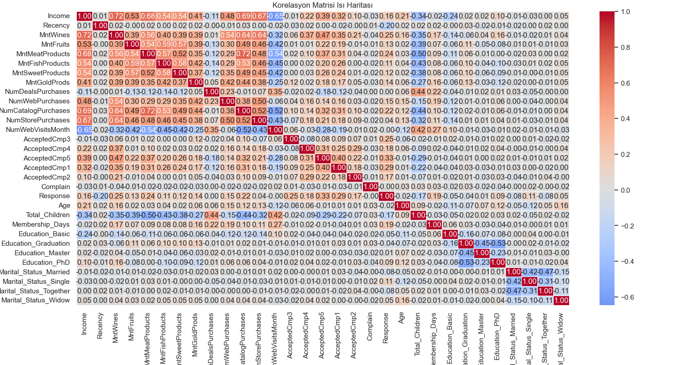
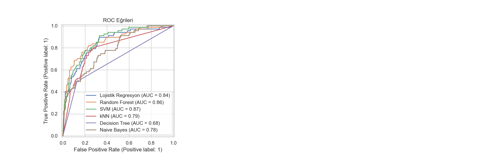
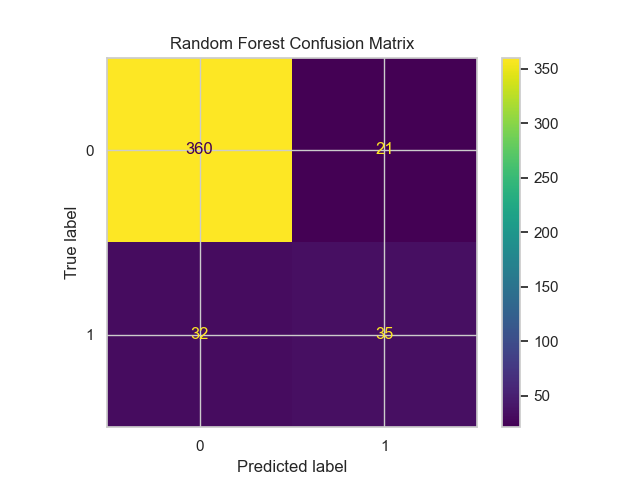
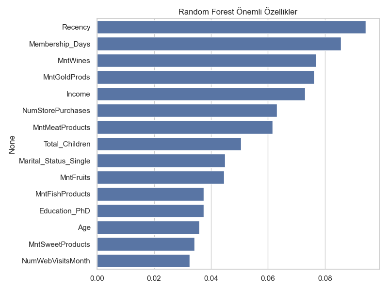

# 🧠 Customer Purchase Behavior Prediction

Bu proje, bir perakende şirketinin müşterilerinin pazarlama kampanyalarına verdikleri yanıtları tahmin etmeyi amaçlayan makine öğrenmesi tabanlı bir çalışmadır. Kullanılan **"Customer Personality Analysis"** veri seti ile müşterilerin demografik özellikleri, alışveriş alışkanlıkları ve kampanya tepkileri detaylı şekilde analiz edilmiştir.

---

## 📁 1. Veri Setinin İncelenmesi

Veri seti pazarlama stratejilerinin kişiselleştirilmesine ve müşteri segmentasyonuna olanak tanır. Müşteri davranışlarını 7 ana başlık altında inceler: demografik bilgiler, hane yapısı, harcamalar, alışveriş kanalları, kampanya tepkileri, web etkileşimleri ve sadakat göstergeleri.

### 📊 Veri Seti Özeti

### 📊 Veri Seti Özeti

| Sütun Adı             | Veri Tipi   | Açıklama                                                   |
|-----------------------|-------------|-------------------------------------------------------------|
| ID                    | Integer     | Müşteri benzersiz kimlik numarası                           |
| Year_Birth            | Integer     | Doğum yılı                                                  |
| Education             | Categorical | Eğitim durumu (Bachelor, Master, PhD, vs.)                  |
| Marital_Status        | Categorical | Medeni durum (Evli, Bekar, vb.)                             |
| Kidhome               | Integer     | Evdeki çocuk sayısı                                         |
| Teenhome              | Integer     | Evdeki ergen çocuk sayısı                                   |
| Income                | Float       | Yıllık gelir (eksik değerler mevcut)                        |
| Dt_Customer           | Date        | Müşterinin kayıt tarihi                                     |
| Recency               | Integer     | Son alışverişten sonra geçen gün sayısı                     |
| MntWines              | Integer     | Yıllık şarap harcaması                                      |
| MntFruits             | Integer     | Yıllık meyve harcaması                                      |
| MntMeatProducts       | Integer     | Yıllık et ürünleri harcaması                                |
| MntFishProducts       | Integer     | Yıllık balık ürünleri harcaması                             |
| MntSweetProducts      | Integer     | Yıllık tatlı harcaması                                      |
| MntGoldProds          | Integer     | Yıllık altın ürünleri harcaması                             |
| NumWebPurchases       | Integer     | İnternet üzerinden yapılan alışveriş sayısı                 |
| NumCatalogPurchases   | Integer     | Katalog üzerinden yapılan alışveriş sayısı                  |
| NumStorePurchases     | Integer     | Mağaza üzerinden yapılan alışveriş sayısı                   |
| NumWebVisitsMonth     | Integer     | Son bir ayda web sitesi ziyaret sayısı                      |
| AcceptCmp1–5          | Binary      | İlk 5 kampanyaya katılım durumu (her biri ayrı sütun)       |
| Complain              | Binary      | Son 2 yılda şikayet durumu                                  |
| Z_CostContact         | Integer     | Pazarlama iletişimi maliyeti                                |
| Z_Revenue             | Integer     | Şirkete sağladığı gelir düzeyi                              |
| Response              | Binary      | Kampanya tepkisi (1 = olumlu, 0 = olumsuz)                  |

---

## 🛠️ 2. Veri Ön İşleme ve Özellik Mühendisliği

### 🔹 2.1 Eksik ve Aykırı Değerler
- `Income` sütunundaki eksik veriler **medyan** ile dolduruldu.
- %95 üzerindeki uç gelir değerleri üst sınıra sabitlendi.

### 🔹 2.2 Yeni Özellikler
- Yaş (`Age`)
- Toplam çocuk sayısı (`Total_Children`)
- Üyelik süresi (`Membership_Days`)

### 🔹 2.3 Kategorik Verilerin İşlenmesi
- `Education`, `Marital_Status`: **One-Hot Encoding**
- Nadir kategoriler (`YOLO`, `Alone`) birleştirildi.

### 🔹 2.4 Gereksiz Sütunların Kaldırılması
- `ID`, `Dt_Customer`, `Z_CostContact`, `Z_Revenue` gibi sütunlar çıkarıldı.

---

## 📊 3. Keşifsel Veri Analizi (EDA)

Özellikler arası korelasyonlar analiz edilerek veri seti hakkında genel bilgi edinildi.

### 🔥 Korelasyon Matrisi Isı Haritası

- `MntWines` ve `MntMeatProducts` yüksek korelasyonlu
- `Response` ile `Recency`: negatif ilişki
- Çoklu bağlantı (multicollinearity) Random Forest gibi modeller için sorun yaratmadı.

---

## 🧪 4. Eğitim/Test Ayrımı ve Sınıf Dengeleme

- %80 eğitim, %20 test olarak veri ayrıldı.
- Dengesiz sınıflar nedeniyle **SMOTE** uygulandı.
- Sadece eğitim verisine uygulandı; test verisi orijinal haliyle bırakıldı.

---

## ⚙️ 5. Özellik Ölçeklendirme

- **StandardScaler** kullanıldı.
- Özellikle SVM ve k-NN gibi algoritmalar için kritik.

---

## 🧠 6. Modelleme ve Hiperparametre Optimizasyonu

Aşağıdaki modeller eğitildi ve `GridSearchCV` + `5-Fold CV` ile optimize edildi:

- Logistic Regression
- Random Forest
- SVM
- k-NN
- Decision Tree
- Naive Bayes

---

## 📈 7. Model Performans Değerlendirmesi

### 📊 ROC Eğrileri

| Model            | Accuracy | Precision | Recall | F1  | ROC-AUC | PR AUC | MCC  |
|------------------|----------|-----------|--------|-----|----------|--------|------|
| **Random Forest** | 0.886    | 0.638     | 0.559  | 0.592 | 0.878    | 0.628  | 0.528 |

- En iyi model: **Random Forest**
- Diğer modeller: SVM, Logistic Regression takip etti

---

## 🔍 8. En İyi Modelin Analizi

### 🧾 Confusion Matrix

- True Negatives: 361
- False Negatives: 33
- False Positives: 20
- True Positives: 34

Model negatif sınıfı iyi tahmin ediyor ancak bazı pozitif sınıflar kaçırılıyor.

---

### 🌟 Feature Importance

- En önemli değişkenler:
  - `Recency`
  - `Membership_Days`
  - `Income`
  - `MntGoldProds`
  - `MntWines`

Bu bilgiler, kampanya hedeflemede ve strateji oluşturmada pazarlama ekiplerine yol gösterici olabilir.

---

## ✅ Sonuç

- Random Forest modeli genel olarak en dengeli ve başarılı model olarak öne çıkmıştır.
- Görsel analizler (confusion matrix ve feature importance) ile modelin güçlü/zayıf yönleri netleştirilmiştir.
- Bu proje, müşteri satın alma davranışını anlamada ve kampanyaların etkinliğini artırmada uygulanabilir sonuçlar üretmiştir.

---

